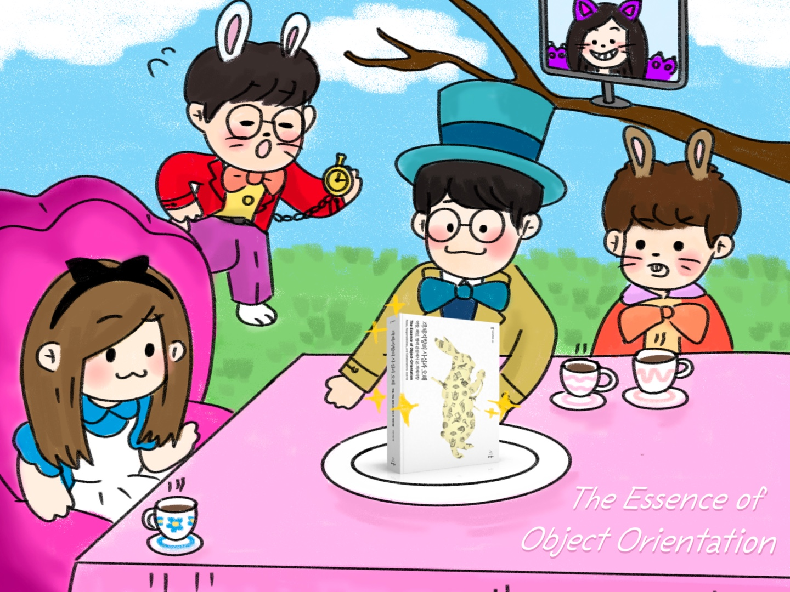
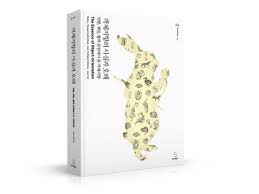

# 객체지향의 사실과 오해 (The Essence of Object-Orientation)

## 📖 교재
[객체지향의 사실과 오해](http://www.yes24.com/Product/Goods/18249021)

## 📜 스터디 진행 방식

- [깃헙 Repository](https://github.com/2022-PNU-CS-Study/The-Essence-of-Object-Orientation)에 각자 공부한 내용을 정리합니다.
- 문서 양식은 따로 정해놓지 않을게요. 각자 자유롭게 자기 스타일로 정리해주세요.
- 단, 바로 main 브랜치에 push 하는 것이 아니라 PR을 생성해서 다른 팀원들에게 review 요청합니다.
- 다른 팀원들이 모두 approve 하면 PR 머지해주세요.
- 각자 다른 팀원들 글을 review 하면서 잘못되었거나 부족해 보이는 부분에 대해 부담없이 comment로 보충하고 토의했으면 좋겠습니다.
- 오프라인 미팅은 매주 수요일 저녁 19시에 진행합니다.
- 미팅은 각 장별로 각자 공부했던 내용에 대해 공유하는 자리입니다.

## 🎙 토의

- 오프라인 미팅에서 한 주간 읽은 부분에 대해서 여러가지 생각들을 나누었으면 좋겠습니다.
- 예를들면, `이 부분에서는 이런 생각을 했다.`, `이 부분에서는 이해가 조금 안되었습니다.`, `이 쪽은 뭔가 흥미롭던데요?`, `저와는 생각이 달라 다른 사람들의 의견을 찾아봤더니 이렇게 생각하는 사람도 있더라.` 등등
- 틀린 의견이라는 것은 없잖아요? 

## 🗂 Github 파일 컨벤션

- 각자의 디렉터리에 정리해서 올려주세요.
- 이번엔 파일 컨벤션을 따로 정하지는 않을게요.

## 🖋 PR

- PR 만드실 때 브랜치는 master에서 `자신의 이름`으로 생성해주세요.
- PR title 이나 commit title 은 자유롭게 작성해주세요.

## 🥤불참 패널티

- 불참 OR 해당 주차 학습을 못했을 시
- 벌금은 조금 부담스러울 수 있으니 해당 주차 혹은 그 다음 주차에 팀원들에게 커피 한잔씩 사주기

## 👩‍💻🧑‍💻 스터디원
 |  |  |  | 
:---: | :---: | :---: | :---: | :---: |
수빈([@subin914](https://github.com/subin914)) | 진호([@zzzinho](https://github.com/zzzinho)) | 혜원([@YumYumNyang](https://github.com/YumYumNyang)) | 우영([@wooyoung-tom](https://github.com/wooyoung-tom)) | 재영([@jaeyeong951](https://github.com/jaeyeong951))
